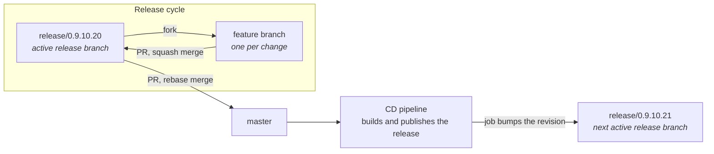

# Contributing to Daybreak

## Getting started

Install the prerequisites listed under
[Build Requirements](README.md#build-requirements), then clone with submodules:

```bash
git clone --recurse-submodules https://github.com/AlexMacocian/Daybreak.git
```

Read the [Architecture Overview](README.md#architecture-overview) before making
changes so you put code in the right project.

## Branching model

There is always exactly one active release branch, named `release/[version]`
(for example `release/0.9.10.20`). It is the integration branch: all work
targets it, and `master` only receives finished releases.



### Feature work

1. Branch off the current release branch.
2. Implement one feature or fix. Keep the branch scoped to a single change.
3. Open a PR against the release branch.
4. Merge with **squash**, so each feature lands as one commit.

### Releasing

1. Open a PR from the release branch onto `master`.
2. Merge with **rebase**, keeping full history. Each feature stays a single
   commit on `master`.
3. The [CD pipeline](.github/workflows/cd.yaml) runs on the push to `master`,
   builds the Windows and Linux bundles and publishes a GitHub release.
4. On success,
   [create-revision-release-branch.yml](.github/workflows/create-revision-release-branch.yml)
   bumps the revision and creates the next `release/[version]` branch
   automatically. That becomes the new active release branch.

Do not push directly to `master` or create release branches by hand.

## Versions

The version lives in a single place,
[`Directory.Build.props`](Directory.Build.props), and follows
`major.minor.build.revision`. It is bumped by the release branch creation job,
not manually.

Revision bumps happen automatically after every release. For the other
components, run the matching workflow manually before starting the next cycle:

| Workflow                                                                                   | Bumps                 |
| ------------------------------------------------------------------------------------------ | --------------------- |
| [create-major-release-branch.yml](.github/workflows/create-major-release-branch.yml)       | `^.0.0.0`             |
| [create-minor-release-branch.yml](.github/workflows/create-minor-release-branch.yml)       | `*.^.0.0`             |
| [create-build-release-branch.yml](.github/workflows/create-build-release-branch.yml)       | `*.*.^.0`             |
| [create-revision-release-branch.yml](.github/workflows/create-revision-release-branch.yml) | `*.*.*.^` (automatic) |

All four delegate to
[create-release-branch-template.yml](.github/workflows/create-release-branch-template.yml).

## Pull requests

Title format follows the existing history: a short description, plus the issue
reference when it closes one.

```text
Setup stable computer name in Wine prefix (Closes #1609)
```

[label-merged-issues.yaml](.github/workflows/label-merged-issues.yaml) parses
`close/fix/resolve #N` from the title and body of PRs merged into a release
branch and labels the linked issues, so use those keywords.

## Checks

[CI](.github/workflows/ci.yaml) and
[version_check.yaml](.github/workflows/version_check.yaml) only trigger on PRs
targeting `master`, so a feature PR onto a release branch is not covered by
them. Run the equivalent locally before opening one:

```bash
dotnet build Daybreak.Linux/Daybreak.Linux.csproj      # or Daybreak.Windows on Windows
dotnet test Daybreak.Tests/Daybreak.Tests.csproj
```

The version check fails a PR to `master` if the version in
`Directory.Build.props` is not ahead of the latest tag. This is why the bump
must come from the release branch job.

## Code style

Formatting rules are in [`.editorconfig`](.editorconfig) and are enforced by the
compiler and analyzers; keep the build warning-free.

Tests live in [`Daybreak.Tests`](Daybreak.Tests), use MSTest with
FluentAssertions and NSubstitute, and only reference `Daybreak.Core`. If you
want platform code covered by tests, put the testable part in
[`Daybreak.Shared`](Daybreak.Shared).
