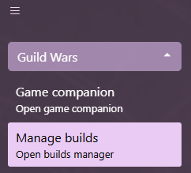
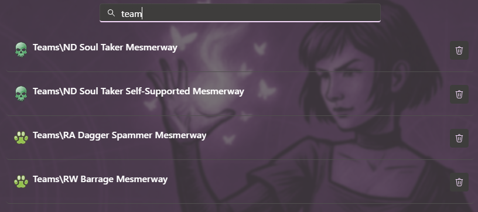
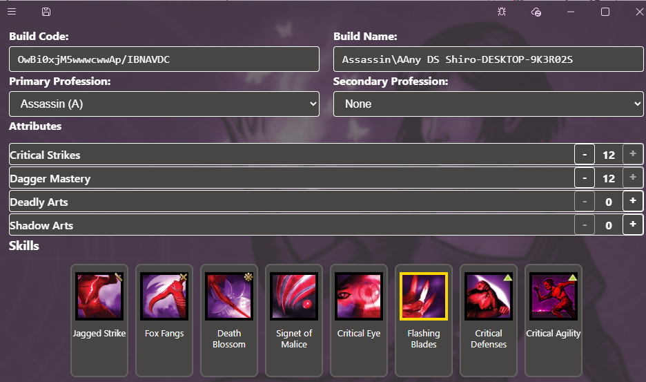
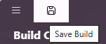
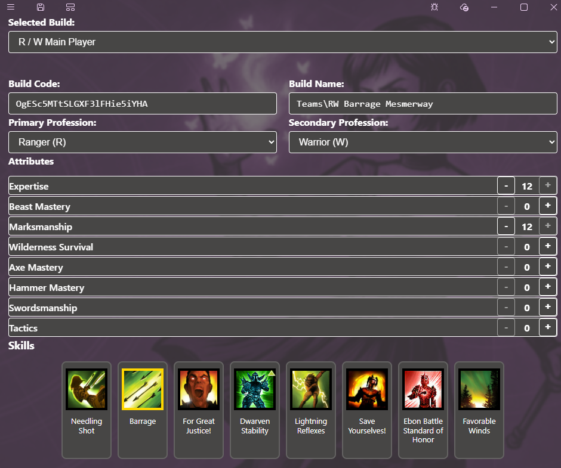

# Build Management

## Open the Build management view

Expand the Guild Wars menu section and open the Manage builds view  

## Delete an existing build

1. Open the [Build management view](#open-the-build-management-view)
2. Find the desired build
3. Click on the bin button to delete the build

## Create a new build

1. Open the [Build management view](#open-the-build-management-view)
2. Click on the add button in left of the titlebar  

## Manage the build list

1. Open the [Build management view](#open-the-build-management-view)
2. Clicking on any build in the list will open the selected build
3. [Search for build](#search-for-a-build)
4. [Delete any build](#delete-an-existing-build)

## Search for a build

Search for build by typing in the Search text box  

## Edit a build

1. Open the [Build management view](#open-the-build-management-view)
2. Click on the desired build. This opens the build edit view  

3. Adjust the build properties
    - Adjust the name by writing in the name text box. Prepend '[Folder Name]\' to add folders to the build path
    - Adjust the build code by writing in the build code text box. This code can also be pasted in Guild Wars
    - Adjust the professions by expanding the profession selection and clicking on the desired profession
    - Adjust the attribute points by pressing the plus and minus buttons on the attribute section. Attribute points are subtracted from the total allocated build points
    - Clicking on an skill slot will open a skill list with available skills (filtered by the selected profession). Click on any skill from the skill list to add it to the build
    - To remove a skill from the build, click on the remove button in the top right corner of the skill slot
    - Save the build by clicking on the save button  
    

### Adjusting team builds/party loadouts

## Integration with GWToolbox builds

Daybreak supports GWToolbox builds. It can load and save builds managed by GWToolbox as well as export vanilla Guild Wars builds into GWToolbox configuration.
