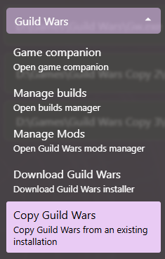

# Copying a Guild Wars Executable

Daybreak is capable of using an existing Guild Wars installation to create new ones

## Copying from an existing executable

1. Expand the Guild Wars menu section and click on the 'Copy Guild Wars' button  

2. If no executable has been already onboarded into Daybreak, the launcher will ask to first [onboard an executable](Executable-Management#setting-up-an-executable)
3. A list of currently managed executables will be opened. Select one of the executables to use as a source
4. A folder selector will open prompting the user to select the destination folder
5. The launcher will start to copy the files
6. Once the copy has finished, Daybreak will automatically onboard the new executable into the [Executables View](Executable-Management#open-executables-settings-view)
7. To use the new copy, [enable the new executable](Executable-Management#switching-executables)
