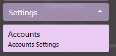

# Credential Management

## Open Account settings view

1. Expand the Settings section of the menu
2. Click on the Accounts button  

## Setting up a user account

1. [Open Account settings view](#open-account-settings-view)
2. Click on the Add button to add a new account entry  

3. Fill in the account information

## Credential storage

- Credentials are encrypted at rest using the [Windows DPAPI](https://en.wikipedia.org/wiki/Data_Protection_API) exposed through the [Protected Data API](https://learn.microsoft.com/en-us/dotnet/api/system.security.cryptography.protecteddata?view=windowsdesktop-8.0)
- Credentials never leave your device
- Credentials are not exposed or logged anywhere in the application
- Credentials are only decrypted when they are being displayed on the screen or when they are passed to the GuildWars executable
