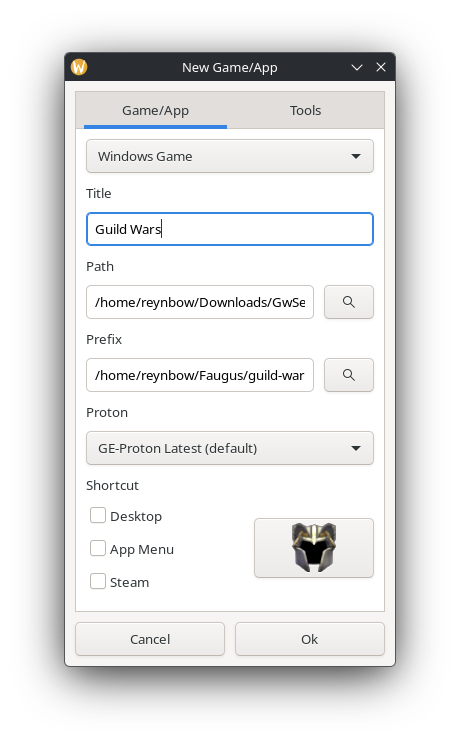
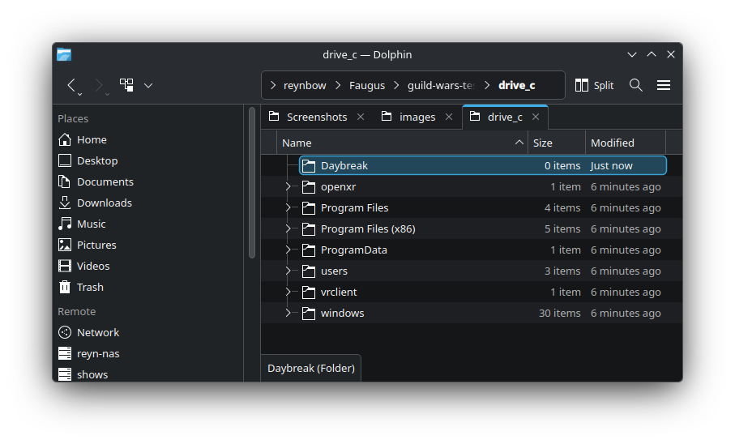
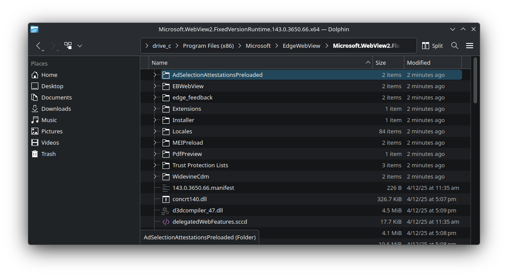
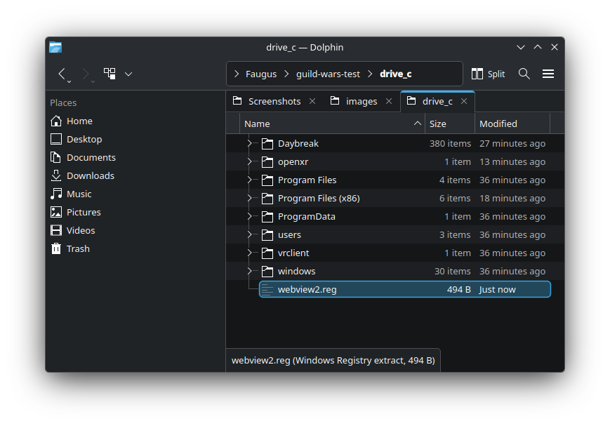
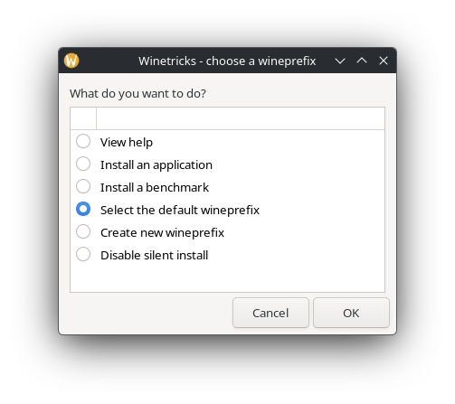
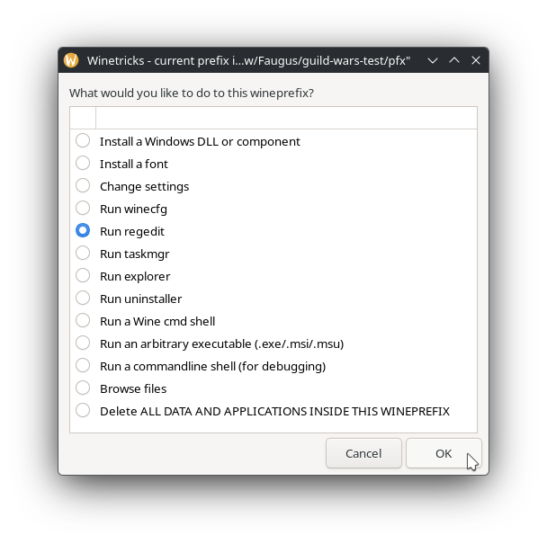
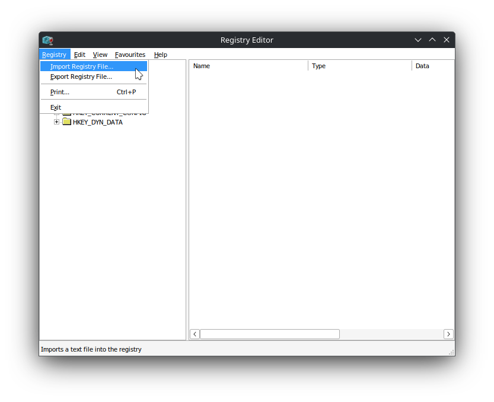
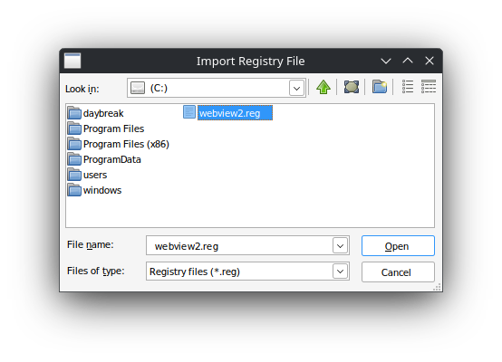
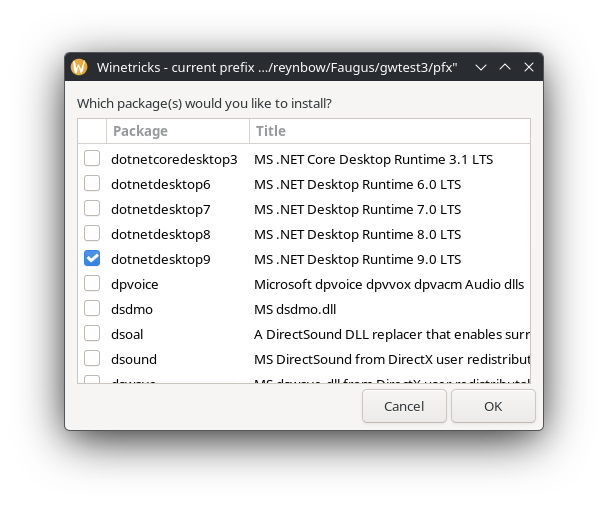

# Daybreak Launcher on Linux – Installation Guide (Experimental)

Source: [Reynbow/guildwars](https://github.com/Reynbow/guildwars)

## Overview

This guide will help you install and configure the Daybreak launcher for Guild Wars on Linux using Faugus.

---

### Install Faugus

Install Faugus via your package manager.

**GitHub:** [faugus-launcher](https://github.com/Faugus/faugus-launcher)

---

## Installation Steps

### 1. Create Guild Wars Prefix in Faugus

1. Open Faugus and click the `+` button in the bottom left corner
2. Enter a title for your game
3. The Prefix will automatically fill
4. Add your Guild Wars installer file (`GwSetup.exe`) by clicking the `search` button
5. Optionally add shortcuts using the tick boxes
6. In the **Tools** tab, ensure `Game Mode` is ticked
7. Click `Ok` to close the window
8. Click the `Play` button or double-click to run



> **Note:** When the Guild Wars installer window appears, you can either let it complete or close it now. For speed and to ensure Daybreak handles the installation, I recommend closing it at this point.

---

### 2. Install Daybreak Launcher

1. **Download Daybreak** from: [Releases](https://github.com/gwdevhub/Daybreak/releases)

2. **Locate your prefix:**
   - Right-click your Guild Wars entry in Faugus
   - Click `Open prefix location`
   - Open the `drive_c` folder

3. **Create Daybreak folder:**
   - Create a new folder named `Daybreak` in `drive_c`
   - Extract the Daybreak .zip contents to this folder  


4. **Update executable path:**
   - Right-click your Guild Wars entry in Faugus
   - Select `Edit`
   - Click the `search` button and select `Daybreak.exe` from the Daybreak folder you created
   - The path will be under `/home/<username>/Faugus/`

---

### 3. Initialize Daybreak (Required)

> **⚠️ IMPORTANT - Initialize Daybreak once**
>
> After setting Daybreak.exe as the executable but before continuing:
>
> 1. Launch Daybreak once
> 2. Wait 10 seconds (blank/white window is expected)
> 3. Close it again
>
> This initializes the WebView2 host environment inside the prefix.

---

### 4. Install Microsoft WebView2 Runtime

#### Download WebView2

1. Go to: [webview2](https://developer.microsoft.com/en-us/microsoft-edge/webview2/)
2. Download the **Evergreen Standalone Installer (x64)**
3. Also download the **Fixed Version** (this will be a .cab file)

#### Run the Installer

1. In Faugus, open the **Tools** tab for your game
2. Click the `Run` button
3. Select `MicrosoftEdgeWebView2RuntimeInstallerX64.exe` that you downloaded
4. Run the installer
   - It may show an error or close/crash when finished - this is normal

#### Extract Fixed Version Files

1. Extract the .cab file contents to a new folder:

   ```sh
   drive_c/Program Files (x86)/Microsoft/EdgeWebView/
   ```



---

### 5. Configure Registry

#### Download Registry File

1. [Download the registry file](https://github.com/Reynbow/guildwars/blob/main/installer/webview2.reg) and place it in your `drive_c` folder

**Registry file preview:**

```pwsh
[HKEY_LOCAL_MACHINE\Software\Microsoft\EdgeUpdate]
"pv"="143.0.3650.66"
"st"=dword:00000001
"doNotSandbox"=dword:00000001

[HKEY_LOCAL_MACHINE\Software\Microsoft\EdgeWebView]
"pv"="143.0.3650.66"

[HKEY_CURRENT_USER\Software\Microsoft\Edge\WebView\Rendering]
"DisableGpu"=dword:00000001
```



#### Import Registry File

1. In Faugus, open the **Tools** tab
2. Click the `Winetricks` button in the bottom right
3. Click `Ok` with `Select the default wineprefix` checked  


4. Select `regedit` and click `Ok`  


5. Click **Registry** → **Import Registry File...**  


6. Choose the `webview2.reg` file you downloaded earlier
7. After import completes, close the registry  


---

### 6. Install .NET Desktop Runtime

1. In Winetricks, select `Install a Windows DLL or component`  


2. Select `dotnetdesktop9` from the list and click `Ok`  


---

## You're Done! 🎉

Daybreak should now work under Linux!

### Next Steps

- Point Daybreak to your existing Guild Wars installation, or
- Have Daybreak install Guild Wars for you in its prefix

Daybreak will handle your mods and GWToolbox entirely.

**Mods for gMod:** [Player-made Modifications](https://wiki.guildwars.com/wiki/Player-made_Modifications/Cartography_Index)
