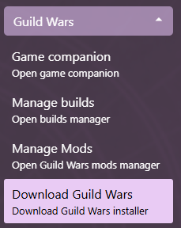

# Download Guild Wars

## Download latest Guild Wars executable

1. Expand the Guild Wars menu section and open the Download Guild Wars view  

2. Select the destination folder for the installer
3. Daybreak will automatically launch the installer
4. Once the installation has finished, [set up the new executable](Executable-Management#setting-up-an-executable)
