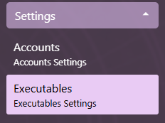
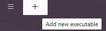

# Executable Management

## Open Executables settings view

1. Expand the Settings section of the menu
2. Click on the Executables button  

## Setting up an executable

1. [Open Executables settings view](#open-executables-settings-view)
2. Click on the Add button to add a new executable  

3. Fill in the path of click on the Open button and choose the Guild Wars executable

## Maintaining an executable

### Version check on Daybreak launch

1. On launch, Daybreak will check that all executables are up to date
2. If an executable is out of date, Daybreak will prompt the user to update
3. Click the notification to start the update process. This will update ALL executables onboarded onto Daybreak

### Version check on Guild Wars launch

1. When launching a Guild Wars instance, Daybreak will check that the executable is up to date
2. If an executable is out of date, Daybreak will prompt the user to update
3. Click the notification to start the update process. This will update only the detected executable

### Version check in Executables View

1. [Open the Executables View](#open-executables-settings-view)
2. If the executable is out of date, a down arrow will appear next to it
3. Click on the down arrow to start the update process
4. If the executable is up to date, a checkmark will appear next to it
