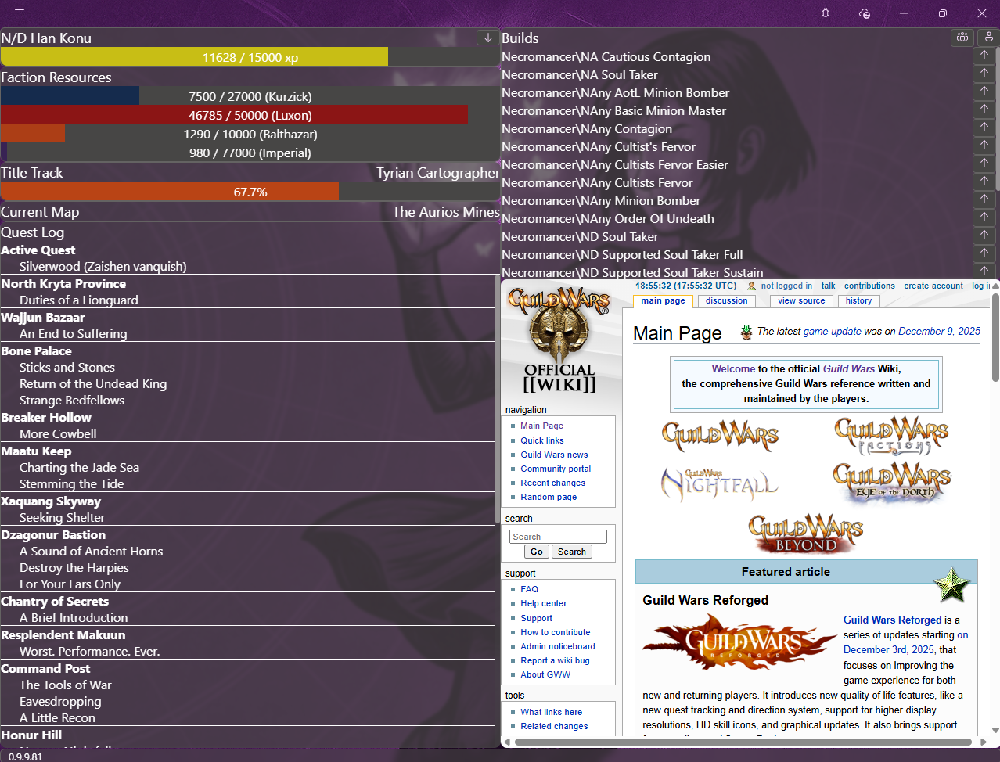
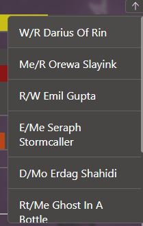
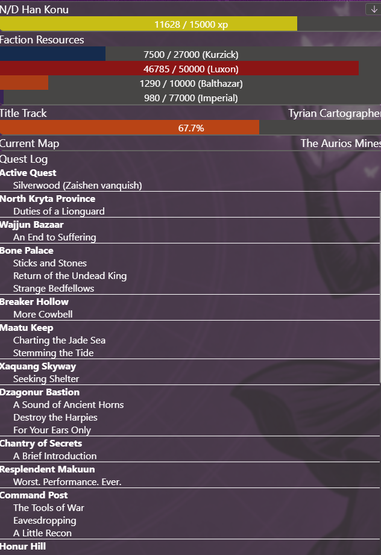

# Focus View

## Intro

Focus View is a feature of Daybreak that replaces the Game Companion view when Guild Wars is running

Focus View collects information about the current running Guild Wars instance and displays it to the user

Please see [Comparison to GwToolboxpp](#comparison-to-gwtoolboxpp) for a comparison between the two tools

## Enabling Focus View

1. Open the [Mods view](Mods#open-mod-management-view)
2. Enable the Daybreak API mod

## Switching characters

1. Click on the down arrow to show a list of available characters for your current account  

2. Click on the name of the character you want to switch to

## Load the current build / party loadout into Daybreak

1. Click on the single / multiple icon to load your current build / party loadout into Daybreak  

2. Edit the build following [these steps](Build-Management#edit-a-build)

## Context hyperlinks

- Click on the Title Track to redirect the embedded browser to the wiki page of the Title Track
- Click on the current map name to redirect the embedded browser to the wiki page of the current map
- Click on the current quest to redirect the embedded browser to the wiki page of the current quest
- Click on any quest in the Quest Log to redirect the embedded browser to the wiki page of the quest

## Vanquishing mode

When Daybreak detects that the character is in hard mode on a map, it enables the vanquishing resource bar. This bar displays information regarding the vanquishing progress of the current instance

## Comparison to GWToolboxpp

Focus View is not meant as a replacement to GWToolboxpp. Instead, it provides some functionality QOL functionality that is meant to compliment GWToolboxpp.

Daybreak injects a module into Guild Wars only when Focus View is enabled. This module exposes a REST+WebSocket API that Focus View uses to extract information from the running Guild Wars instance. Similarly, GWToolbox injects its own module into Guild Wars to provide its functionality.

Focus View currently runs exclusively in read mode. That means, it won't facilitate the automation of any action on the running guild wars process. Any information extracted from guild wars can only be displayed to the user, but it can't be changed.
