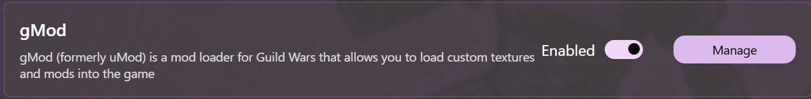

# gMod Management

Daybreak allows you to install and manage texture mods for Guild Wars. Daybreak will also order your texture packs based on the user selection.

## Open gMod management view

1. Open [mods management view](Mods#open-mod-management-view)
2. Click on manage gMod  

## Load a texture mod

Click on the add button on the titlebar in order to import a new texture pack  

## Enable/disable a texture pack

To enable/disable a texture pack, flip the switch on the mod row

## Reorder texture packs

gMod only loads a texture override once. This means that once a texture pack loads a texture, subsequent packs will not be able to load the same texture

To ensure best results, Daybreak allows users to reoder texture packs

Use the arrows on the mod row to determine the priority of a texture pack, with the **top being highest priority** and **the bottom being lowest priority**

## Remove a texture pack

To remove a texture pack from Daybreak, click on the bin button on the mod row. This will not delete the actual texture file, it will simply remove it from Daybreak's internal tracking list