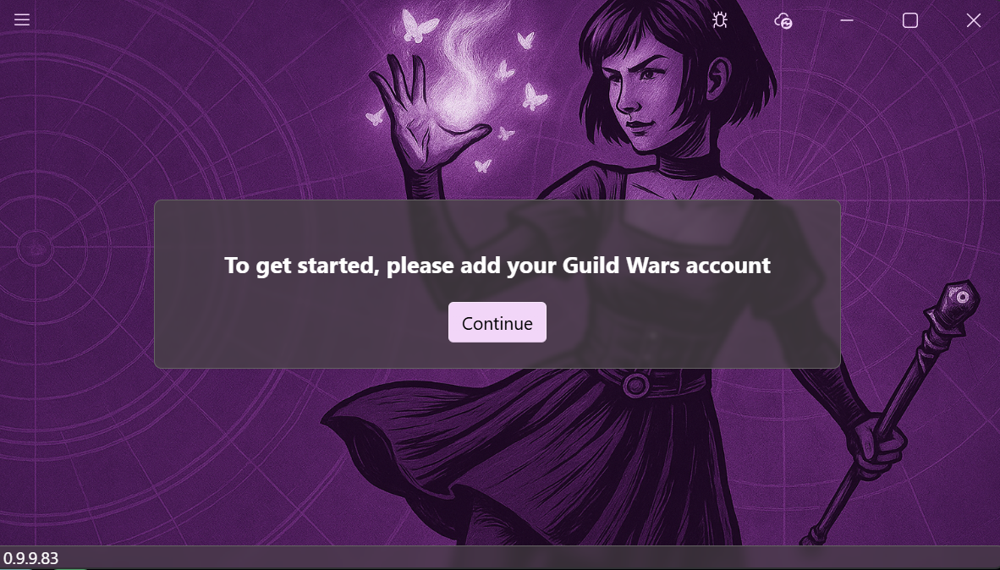
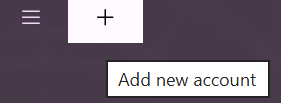
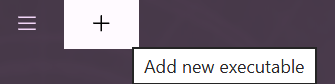
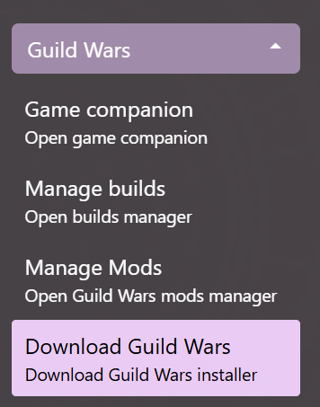
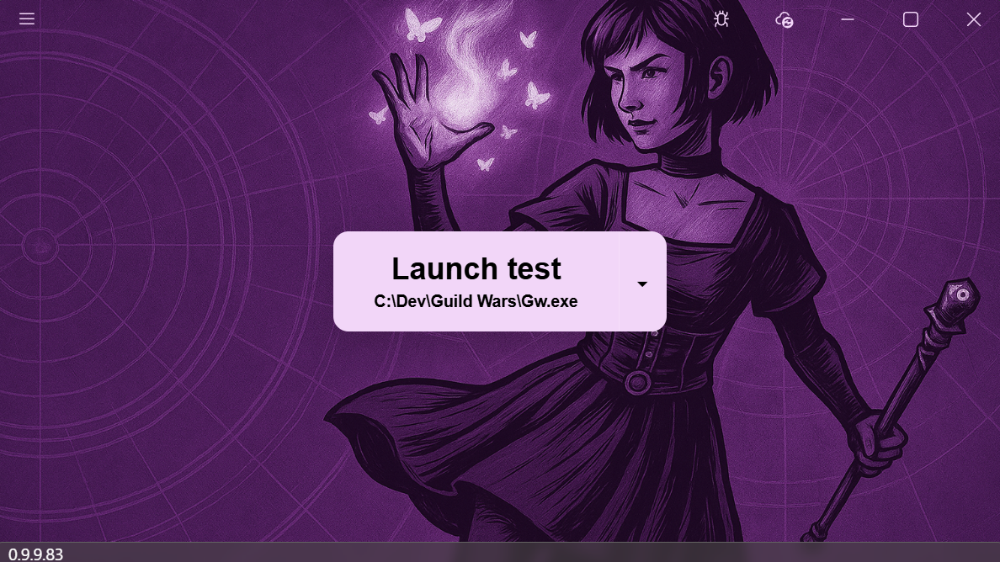

# Getting started

## Download Daybreak

- Go to [latest release](https://github.com/AlexMacocian/Daybreak/releases/latest) to get to the download page of the latest version
- Download and extract the zip archive to any location on your computer
- Open the Daybreak.exe executable to open the launcher

## First time setup

When you first open Daybreak, you're greeted with the `Game Companion` view asking you to create an account. Click on continue to proceed to the [account onboarding](#onboard-an-account)

### Onboard an account
- Click on continue to onboard your first Guild Wars account
- Click on the add button in the titlebar to add a new account  

For more details on credential management, go to [Credential Management](Credential-Management)

### Onboard an executable

When you return to the Game Companion view, you'll be prompted to add a Guild Wars executable. You can either [onboard an existing executable](#existing-guild-wars-installation) or you can [download guild wars through Daybreak](#download-guild-wars)

For more details on executable management, go to [Executable Management](Executable-Management)

#### Existing Guild Wars installation

- Click on the add button in the titlebar to add an executable  

- Find your existing `Gw.exe` and load it into Daybreak

#### Download Guild Wars

Daybreak can download and install Guild Wars. To do that, navigate to `Download Guild Wars` view, select a destination folder and let Daybreak download and install the game  

### Setup a launch configuration

The last step of the onboarding process requires that you setup a launch configuration. [Launch Configurations](Launch-Configurations) tell Daybreak how to launch your game.
- Navigate to `Game Companion` to be prompted to create a launch configuration
- Click on continue to go to Launch Configurations view
- Click on the add button in the titlebar to add a new launch configuration  

- Set your desired credential
- Set your desired executable

For more details on launch configurations, go to [Launch Configurations](Launch-Configurations)

### Launch Guild Wars

Once we have a launch configuration set up, go back to `Game Companion` view. This time you should be seeing the launch button with your configuration. Click on the `Launch` button to launch your game  
