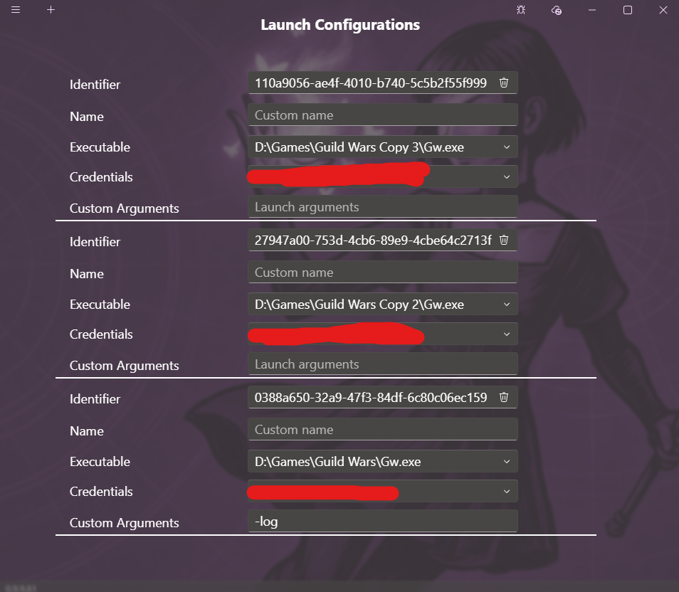
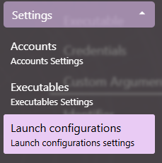
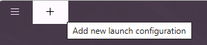

# Launch configurations

Daybreak allows the creation of multiple launch configurations by combining executables and credentials. These launch configurations are used to tell Daybreak how to launch Guild Wars.  

## Access launch configurations settings

1. Click on the menu button to expand the menu
2. Expand the Setting section
3. Click on Launch configurations  

## Creating a launch configuration

1. [Access the launch configuration settings](#access-launch-configurations-settings)
2. Click on the add button  

3. [Modify the new configuration](#modifying-a-launch-configuration)

## Deleting a launch configuration

1. [Access the launch configuration settings](#access-launch-configurations-settings)
2. Click on the bin button next to the configuration you want to delete  

## Modifying a launch configuration

1. [Access the launch configuration settings](#access-launch-configurations-settings)
2. Click on the configuration you want to modify
3. Select a set of credentials and an executable
4. Adjust the arguments passed to Guild Wars
