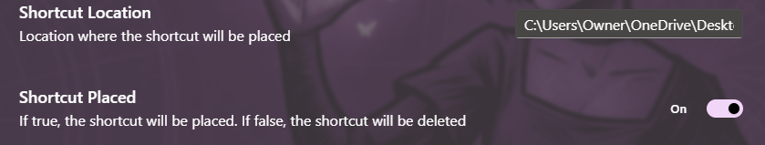

# Place launcher shortcut

Daybreak can auto-manage a shortcut to the launcher

## Enable the shortcut

1. Expand the Settings menu section and open the Launcher settings  

2. Choose where the shortcut should be placed
3. Enable/Disable shortcut  

