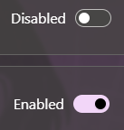
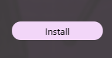
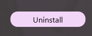
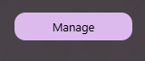

# Mods

Mods are user-installed modifications that enhance or change the functionality of Guild Wars. They can provide additional features, improve user experience, or add new tools to assist with gameplay

## Open Mod Management view

1. Open mod management view  

## Enable/Disable a mod

1. Open the [Mod Management view](#open-mod-management-view)
2. Find the desired mod in the list
3. Flip the Enabled switch to enable or disable the mod  

## Install a mod

1. Open the [Mod Management view](#open-mod-management-view)
2. Click on the install button and follow the instructions  

## Uninstall a mod

1. Open the [Mod Management view](#open-mod-management-view)
2. Disable the mod
3. Click on the uninstall button  

## Manage a mod

1. Open the [Mod Management view](#open-mod-management-view)
2. Enable the mod
3. Mods that can be managed will have a Manage button next to their Enabled switch
4. Click on the Manage button to open the mod settings view  

## Supported mod list

- Auto screen placer
  - Allows you to automatically position and resize Guild Wars windows on launch
- Daybreak API
  - Enables Daybreak to inject a custom API module into Guild Wars
  - Exposes functionality that is used by Focus View
  - For a detailed explanation, check [Daybreak API documentation](Daybreak-API#summary)
- DirectSong
  - Enables custom Guild Wars soundtracks composed by Jeremy Soule
  - The files need to be downloaded before they can be used
  - Daybreak automatically downloads the files before enabling the mod for the first time
- [gMod](GMod-Management)
  - [Developed by gwdevhub](https://github.com/gwdevhub/gMod)
  - Texture mod loader for Guild Wars
  - Replacement for uMod and texMod
  - Daybreak manages the setup and deployment of texture packs
- GuildWars Version Checker
  - Checks for updates to the Guild Wars client and notifies you when a new version is available
  - Disables launch if the client is out of date
- GWToolbox
  - [Developed by gwdevhub](https://github.com/gwdevhub/GWToolboxpp)
  - Provides a ton of quality of life features for Guild Wars
- [ReShade](ReShade-Management)
  - [Developed by crosire](https://reshade.me/)
  - Advanced post-processing injector for games and video software
  - Allows you to enhance the graphics of Guild Wars with custom shaders
  - Daybreak manages the setup and deployment of ReShade
