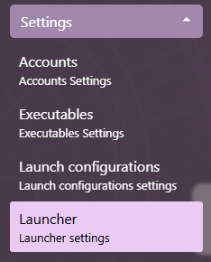
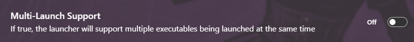
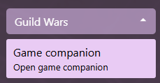

# Multi-Launch (Multi-Box) support

By default, Daybreak supports only one Guild Wars executable. You can enable Multi-Launch Support by following these steps:

1. Expand the Settings section of the menu and open the Launcher settings view  

2. Enable Multi-Launch Support from the settings list  

3. Launch executables from Game Companion  

