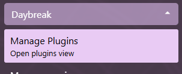
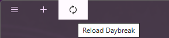
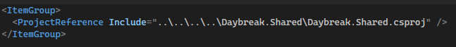
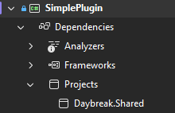

# Daybreak Plugins (alpha)

This page will contain a breakdown of what are Daybreak plugins, how to enable/disable plugins in Daybreak as well as to how to write a custom plugin.

## Introduction

Daybreak plugins are executables that are loaded into the AppDomain of the running Daybreak launcher. They can contain any type of C# code as well as can import their own dependencies and libraries.
Ultimately they can do anything that a C# dotnet application can do.
*Note - Plugin dependency support is still pretty spotty. Future releases will eventually solve the plugin dependency importing*

## Plugins in Daybreak

### Open Plugin Management View

Expand the Menu section and click on the Plugins subsection  


### Enable and disable a plugin

1. [Open the Plugin Management View](#open-plugin-management-view)
2. Switch the toggle of the desired plugin
3. Restart Daybreak  


### Plugin details

Each entry in the [Plugin Management View](#open-plugin-management-view) shows details about the detected plugin.

## Coding your own plugin

This section contains details about the functionality of the Daybreak code and expects the reader to have some basic understanding of programming, OOP principles, dependency injection, inheritance as well as some basic level of C# and .net knowledge

### Framework basics

Daybreak is written in [Blazor Hybrid](https://learn.microsoft.com/en-us/aspnet/core/blazor/hybrid/?view=aspnetcore-10.0), hosted in [Photino.Blazor](https://github.com/tryphotino/photino.Blazor)

### Quickstart Guide

As an example, check out [SimplePlugin](https://github.com/AlexMacocian/Daybreak/tree/master/Examples/Plugins/SimplePlugin).  
*The following guide is written for Visual Studio 2022. You can use any other text editor/IDE, but your steps will differ slightly*

To create a new plugin:

1. Clone the [Daybreak](https://github.com/AlexMacocian/Daybreak.git) repository
2. Create a new .net (preferably .net 10) library in Visual Studio anywhere on your PC
3. Import `Daybreak.Shared.csproj` into your new Solution
4. In your new `.csproj`, add a Project Reference to the Daybreak.Shared.csproj  
  (*Note: Don't copy the exact path you see in this picture. Modify it to match the path from your .csproj to Daybreak.Shared.csproj*)  
    
  If successful, in Visual Studio, you should see Daybreak show up in the Dependencies tab  
    
5. Create a new class and inherit from [PluginConfigurationBase](https://github.com/gwdevhub/Daybreak/blob/master/Daybreak.Shared/Models/Plugins/PluginConfigurationBase.cs) (from Daybreak.Shared.Models.Plugins namespace)

   ```C#
   public sealed class PluginConfiguration : PluginConfigurationBase
   {
   }
   ```

6. Build the project
7. Go to the output directory (usually it is in [Project path]/bin/[Debug|Release]/[Chosen .net version]/
8. Copy your .dll(s) into Daybreak/Plugins/[Your plugin name]/
9. Launch Daybreak

### Configuring a plugin / Building the PluginConfigurationBase class

Plugins get access to almost the same setup as the main Daybreak binary.
Since this code is still in alpha, please check [PluginConfigurationBase.cs](https://github.com/gwdevhub/Daybreak/blob/master/Daybreak.Shared/Models/Plugins/PluginConfigurationBase.cs) for the latest functionality.

#### Configuration overrides

Plugins get to pick which configuration steps to override. As of writing this document, the following overrides are exposed

- RegisterServices
- RegisterViews
- RegisterStartupActions
- RegisterPostUpdateActions
- RegisterOptions
- RegisterNotificationHandlers
- RegisterMods
- RegisterBrowserExtensions
- RegisterLaunchArgumentHandlers
- RegisterMenuButtons
- RegisterThemes
- RegisterProviderAssemblies

Plugins also get to use the following methods

- SetupLoggingAndMetrics
- SetupDaybreakUserAgent
- SetupChromeImpersonationUserAgent

#### Configuration overrides continued

1. `RegisterServices` provides a [IServiceCollection](https://learn.microsoft.com/en-us/dotnet/api/microsoft.extensions.dependencyinjection.iservicecollection?view=dotnet-plat-ext-7.0) parameter. This is the standard service collection used by most .net projects that implement DI. Here, a plugin can register its services and setup lifetimes for the services.
2. `RegisterViews` provides a [IViewProducer](https://github.com/gwdevhub/Daybreak/blob/master/Daybreak.Shared/Services/Navigation/IViewProducer.cs) parameter. Here a plugin can register their own views (as a UserControl). Using [IViewManager](https://github.com/gwdevhub/Daybreak/blob/master/Daybreak.Shared/Services/Navigation/IViewManager.cs), the plugin can then later navigate to those views by calling `viewManager.ShowView<TRegisteredViewType>()`
3. `RegisterStartupActions` provides a [IStartupActionsProducer](https://github.com/gwdevhub/Daybreak/blob/master/Daybreak.Shared/Services/Startup/IStartupActionProducer.cs) parameter. Here, the plugin can register a [StartupActionBase](https://github.com/gwdevhub/Daybreak/blob/master/Daybreak.Shared/Models/StartupActionBase.cs) that gets executed by Daybreak on startup.
4. `RegisterPostUpdateActions` provides a [IPostUpdateActionsProducer](https://github.com/gwdevhub/Daybreak/blob/master/Daybreak.Shared/Services/Updater/PostUpdate/IPostUpdateActionProducer.cs) parameter. Here, the plugin can register a [PostUpdateActionBase](https://github.com/gwdevhub/Daybreak/blob/master/Daybreak.Shared/Models/PostUpdateActionBase.cs) that gets executed by Daybreak after an update.
5. `RegisterOptions` provides an [IOptionsProducer](https://github.com/gwdevhub/Daybreak/blob/master/Daybreak.Shared/Services/Options/IOptionsProducer.cs) parameter. Here, the plugin can register options models that can later be retrieved using DI by requesting `IOptions<TOption>`, `ILiveOptions<TOption>`, `IUpdateableOptions<TOption>`, `ILiveUpdateableOptions<TOption>`.
`IOptions` is a readonly value of the option that gets initialized once, meaning that if the options change during runtime, the value will not change unless requested again through DI.
`ILiveOptions` requests the options value every time it is used in code, meaning that if the options change, the code will use the latest option.
`IUpdateableOptions` provides a way for your code to update the options, but it won't always retrieve the latest value of the options.
`ILiveUpdateableOptions` allows to update the options and will also always retrieve the latest value of the options.
6. `RegisterNotificationHandlers` provides a [INotificationHandlerProducer](https://github.com/AlexMacocian/Daybreak/blob/master/Daybreak/Services/Notifications/INotificationHandlerProducer.cs) parameter. Here, the plugin can register a [INotificationHandler](https://github.com/gwdevhub/Daybreak/blob/master/Daybreak.Shared/Services/Notifications/INotificationHandlerProducer.cs). This handler will get called when a notification associated with this handler is being opened. Check [INotificationService.NotifyInformation/NotifyError`<TNotificationHandler`>](https://github.com/gwdevhub/Daybreak/blob/master/Daybreak.Shared/Services/Notifications/INotificationService.cs) for details.
7. `RegisterMods` provides a [IModsManager](https://github.com/gwdevhub/Daybreak/blob/master/Daybreak.Shared/Services/Mods/IModsManager.cs) parameter. Here, the plugin can register a [IModService](https://github.com/gwdevhub/Daybreak/blob/master/Daybreak.Shared/Services/Mods/IModService.cs).
8. `RegisterBrowserExtensions` provides a [IBrowserExtensionsProducer](https://github.com/gwdevhub/Daybreak/blob/master/Daybreak.Shared/Services/Browser/IBrowserExtensionsProducer.cs). Here, the plugin can register a [IBrowserExtension](https://github.com/gwdevhub/Daybreak/blob/master/Daybreak.Shared/Services/Browser/IBrowserExtension.cs). Browser extensions allow the mod to set up Chrome extensions for the embedded browser.
9. `RegisterLaunchArgumentHandlers` provides a [IArgumentHandlerProducer](https://github.com/gwdevhub/Daybreak/blob/master/Daybreak/Services/ApplicationArguments/IArgumentHandlerProducer.cs). Here, the plugin can register a [IArgumentHandler](https://github.com/gwdevhub/Daybreak/blob/master/Daybreak.Shared/Services/ApplicationArguments/IArgumentHandlerProducer.cs). Argument handlers specify an identifier and expected count of arguments. On startup, if provided arguments match the identifier and expected count, the handler will be called to process the command line arguments.
10. `RegisterMenuButtons` provides a [IMenuServiceProducer](https://github.com/gwdevhub/Daybreak/blob/master/Daybreak.Shared/Services/Menu/IMenuServiceProducer.cs). Menu buttons can be registered per categories, as seen in [ProjectConfiguration.RegisterMenuButtons](https://github.com/gwdevhub/Daybreak/blob/master/Daybreak/Configuration/ProjectConfiguration.cs#L369).
11. `RegisterThemes` provides a [IThemeProducer](https://github.com/gwdevhub/Daybreak/blob/master/Daybreak.Shared/Services/Initialization/IThemeProducer.cs). Plugins can use this to register custom themes for Daybreak. Check out [CoreThemes](https://github.com/gwdevhub/Daybreak/blob/master/Daybreak/Themes/CoreThemes.cs) for examples.
12. `RegisterProviderAssemblies` provides a [IProviderAssemblyProducer](https://github.com/gwdevhub/Daybreak/blob/master/Daybreak.Shared/Services/FileProviders/IFileProviderProducer.cs). Here, the plugin can register assemblies that contain embedded resources that can be used by Daybreak's web view. Check out [SimplePlugin.csproj](https://github.com/gwdevhub/Daybreak/blob/master/Examples/Plugins/SimplePlugin/SimplePlugin/SimplePlugin.csproj) on how the resources are embedded and used.

### Http Calls

*It is strongly advised that you use the in-built http client implementation as it comes with hooks into the metrics and logging system. As such, once you follow the steps below for configuring and using the client, you'll get metrics on the average latency of your request in the Menu > Diagnostics > Metrics view as well as detailed logging of the request and responses in the Menu > Diagnostics > Logs view.*

Daybreak provides a built-in way of handling http calls. In the `RegisterServices` override, setup your desired http client with

```C#
serviceManager
    .RegisterHttpClient<TService>()
        .WithMessageHandler(this.SetupLoggingAndMetrics<TService>)
        .WithDefaultRequestHeadersSetup(this.SetupDaybreakUserAgent)
        .Build()
```

Now that the DI is configured, in your service `TService`, simply take a dependency on `IHttpClient<TService>`.

### Logging

By default, Daybreak comes with a `ILogger<T>` resolver implemented directly into the DI engine.

For an example on how to perform logging, check [InternetCheckingService](https://github.com/AlexMacocian/Daybreak/blob/master/Daybreak/Services/InternetChecker/InternetCheckingService.cs) and the usage of `ILogger<InternetCheckingService>`.

To log messages, take a dependency on `ILogger<TService>` and simply use it to log information.

Your logs will be visible in Menu > Diagnostics > Logs view. You can also use `Ctrl + F` to search for key words through the logs.

### Metrics

*Currently, only metrics of type `double` are supported. Also, Daybreak doesn't currently store metrics across sessions. Once you close the application, your metrics will be lost*

Daybreak exposes an [IMetricsService](https://github.com/gwdevhub/Daybreak/blob/master/Daybreak.Shared/Services/Metrics/IMetricsService.cs) through the DI engine.

Simply take a dependency on `IMetricsService`.
Then, create your histogram by calling `metricsService.CreateHistogram<double>`.
For an example, check out [InternetCheckingService](https://github.com/gwdevhub/Daybreak/blob/master/Daybreak/Services/InternetChecker/InternetCheckingService.cs)

To record metrics, call `myHistogram.Record(value)`.

You can view your metrics in the Menu > Diagnostics > Metrics.

### Notifications

Daybreak provides a service for emitting notifications to the user.

Currently, notifications have two levels, `Information` and `Error`.

To emit notifications, take a dependency on `INotificationService` and call `notificationService.NotifyInformation` or `notificationService.NotifyError`.

Notifications support custom handlers that get triggered when the user opens the notification. For an example, check out the [TradeMessageNotificationHandler](https://github.com/gwdevhub/Daybreak/blob/master/Daybreak/Services/TradeChat/Notifications/TradeMessageNotificationHandler.cs).

To link notifications to your notification handler, implement a `TNotificationHandler` of type `INotificationHandler`, and call `notificationService.NotifyInformation<TNotificationHandler>`. Daybreak will link your handler to your notification, so when the user opens your notification, it triggers your handler.

### Guild Wars Integration

Daybreak currently integrates with Guild Wars through the [Daybreak.API](https://github.com/gwdevhub/Daybreak/tree/master/Daybreak.API) project. The `Daybreak.API` executable is injected into Guild Wars at startup and exposes functionality through a asp.net server. To interact with running Guild Wars instances, use the [IDaybreakApiService](https://github.com/gwdevhub/Daybreak/blob/master/Daybreak/Services/Api/DaybreakApiService.cs) to obtain a [ScopedApiContext](https://github.com/gwdevhub/Daybreak/blob/master/Daybreak.Shared/Services/Api/ScopedApiContext.cs) for a particular Guild Wars session.

### View Navigation

Daybreak provides a centralized way of navigating through views by using `IViewManager`.

First, register your views in `RegisterViews` override.

Then, take a dependency on `IViewManager` and use `viewManager.ShowView<TView>()` to navigate to your view. If you want to pass some data to your view, call `viewManager.ShowView<TView>((parameterName, parameterValue))`. These parameters will be set on the view parameters.

### Privilege Mode

If your plugin requires Daybreak to run in privileged mode (eg. Administrator rights), take a dependency on [IPrivilegeManager](https://github.com/gwdevhub/Daybreak/blob/master/Daybreak.Shared/Services/Privilege/IPrivilegeManager.cs).

Determine if Daybreak is already running in Privileged Mode by using `privilegeManager.AdminPrivileges`.

If you want to escalate Daybreak to administrator, call `privilegeManager.RequestAdminPrivileges<TCancelView>(messageToUser, dataContextOfCancelView)`. In case the user declines the escalation, Daybreak will redirect the user to the `TCancelView` view. If you don't know what view to use, simply use `LauncherView` as a cancel view as this is the landing page of Daybreak.
