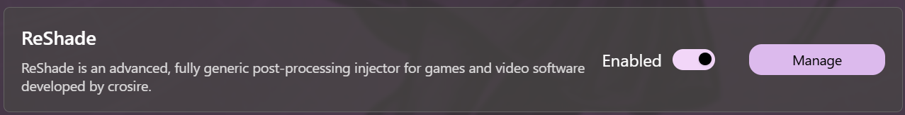
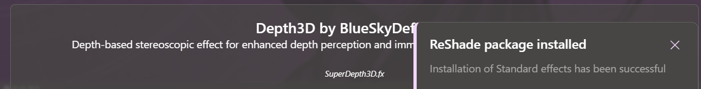
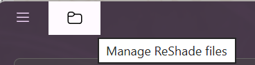

# ReShade Management

Daybreak allows you to download and install a set of predefined shaders through the management view. You can also apply custom shaders by copying them inside the `ReShade` folder under `Daybreak` root folder.

## Open ReShade management view

1. Open [mods management view](Mods#open-mod-management-view)
2. Click on manage ReShade  

## Download a shader package

Each shader package contains a list of effects. Click on the package row to make Daybreak download and install that package. Once the installation completes, Daybreak will show a notification  

## Manage ReShade folder

Daybreak installs and sets up ReShade under the Daybreak root folder. For quick access, click on the titlebar button  
