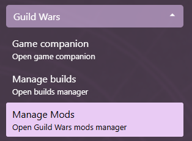

# Screen affinity

## Set Guild Wars window position on launch

Daybreak can auto-place Guild Wars on any desired screen.

1. Expand the Guild Wars menu section and open the Mods settings view  

2. Enable/disable the [Auto screen placer](Mods#supported-mod-list)
3. Click on the [Manage](Mods#manage-a-mod) button next to the Enabled switch
4. Select the desired screen by clicking on it
