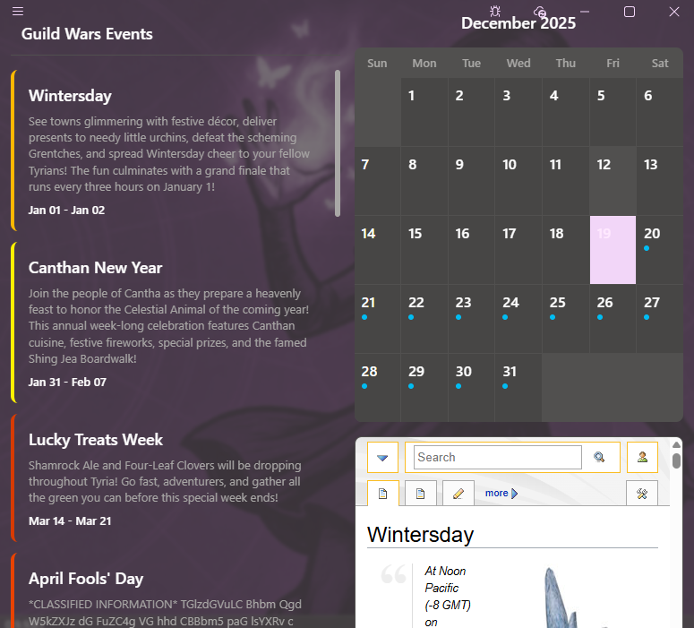
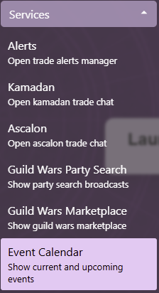
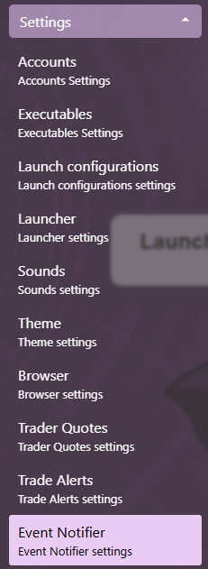

# Seasonal Events Calendar

## Opening Calendar View

1. Expand the Services menu section and open the Event Calendar view  

## Using Calendar View

- Clicking on any event in the list will move the Calendar to the date when the next start date of the event. The browser will also navigate to the page of the event

- Clicking on any day in the calendar that has an event, will select the event in the list and navigate the browser to the event

## Event notifications

Daybreak checks the current dates for seasonal events. When it detects that a season should be available, it emits a notification for the user.

### Enabling/Disabling seasonal events notifications

1. Expand the Settings menu section and open the Event Notifier settings view  

2. Switch the toggle to enable/disable the notifications
