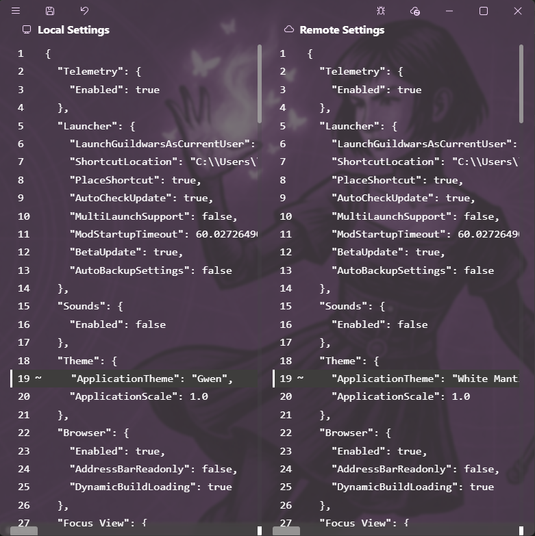
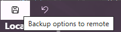
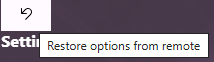

# Settings Synchronization

## Opening settings synchronization view

1. Click on the setting synchronization button  

2. Log into OneDrive
3. Open the Synchronization view  

## Back-up settings

1. Open the [settings synchronization view](#opening-settings-synchronization-view)
2. Click on the backup button  

## Restore settings

1. Open the [settings synchronization view](#opening-settings-synchronization-view)
2. Click on Download  

