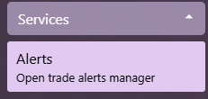

# Trade Alerts

Daybreak can monitor the [Kamadan](https://kamadan.gwtoolbox.com) and [Ascalon](https://ascalon.gwtoolbox.com) trade messages and alert the user when a trade message meets certain requirements.

## Accessing Alerts View

1. Expand the Services menu section and click on the Alerts button  

2. A list of trade alerts will appear on the main screen  

## Creating a new alert

1. [Access the Alerts View](#accessing-alerts-view)
2. Click on the buttons to create a quote or a message alert  

3. Adjust the name of the alert
4. Enable the alert by flipping the 'Enabled' toggle to On

## Enabling an alert

1. [Access the Alerts View](#accessing-alerts-view)
2. Click on the desired alert
3. Flip the 'Enabled' toggle to On

## Disabling an alert

1. [Access the Alerts View](#accessing-alerts-view)
2. Click on the desired alert
3. Flip the 'Enabled' toggle to Off

## Deleting an alert

1. [Access the Alerts View](#accessing-alerts-view)
2. Click on the 'Bin' button on the desired alert

## Triggering alerts

Once alerts are Enabled, they will automatically trigger based on the [alert rules](#creating-a-new-alert). When an alert is triggered, a [notification](Notifications) will pop up mentioning the source trade chat (Kamadan/Ascalon) and the trade details
