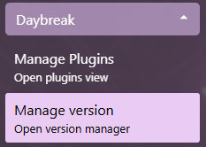

# Daybreak Version Management

Daybreak can check and perform updates when new versions are available

## Enabling update checking

Daybreak can periodically check for updates

To enable this feature, follow the steps:

1. Expand the Settings menu section and open the Launcher settings  

2. Enable Auto-Check For Updates

## Manage version

1. Expand the Daybreak menu section and open the Manage client version view  

2. Click on a version button will open the browser and redirect to the github release page of that version
3. Click on the download button of a version to trigger Daybreak to download the specified version
