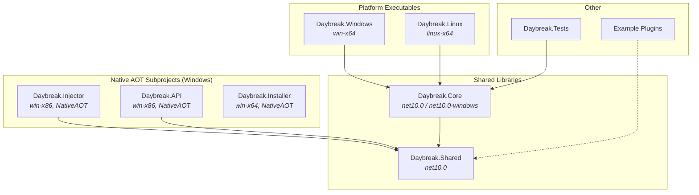

# Daybreak


Custom launcher for Guild Wars.

## Download

- Go to [Releases](https://github.com/AlexMacocian/Daybreak/releases/latest)
- Download daybreakv[VERSION].zip, where [VERSION] is the version of the release

## Features

Please check the [wiki](https://github.com/AlexMacocian/Daybreak/wiki) for
project description and features.

---

## Architecture Overview

Daybreak is a cross-platform application built with .NET 10 and Photino.Blazor. The launcher provides a native UI on each platform while sharing the majority of business logic through a common core library.

### Project Structure



### Component Descriptions

| Project | Description |
|---------|-------------|
| **Daybreak.Windows** | Windows executable with WebView2, MSAL authentication, shortcuts, and native screen management |
| **Daybreak.Linux** | Linux executable using GTK/WebKit via Photino, with Wine-based game injection |
| **Daybreak.Core** | Shared Blazor UI, services, and configuration (multi-targeted for Windows-specific features) |
| **Daybreak.Shared** | Common models, utilities, and interfaces used across all projects |
| **Daybreak.Injector** | NativeAOT x86 executable that injects DLLs into the Guild Wars process |
| **Daybreak.API** | NativeAOT x86 library injected into Guild Wars, exposes game data via WebSocket/REST |
| **Daybreak.Installer** | Standalone installer/updater executable |

### Platform-Specific Services

The platform executables provide their own implementations for OS-specific functionality:

- **Windows**: Native Win32 APIs for screen management, keyboard hooks, process injection, Microsoft Graph integration
- **Linux**: Stub implementations with Wine-based process injection (uses `wine Daybreak.Injector.exe`)

---

## Build Requirements

### Windows

- .NET 10 SDK
- ASP.NET Core Runtime
- WebView2 Runtime (<https://go.microsoft.com/fwlink/p/?LinkId=2124703>)

### Linux

#### Arch

```bash
sudo pacman -S dotnet-sdk aspnet-runtime
```

#### Ubuntu/Debian

```bash
# Add Microsoft package repository
wget https://packages.microsoft.com/config/ubuntu/$(lsb_release -rs)/packages-microsoft-prod.deb \
  -O packages-microsoft-prod.deb
sudo dpkg -i packages-microsoft-prod.deb
rm packages-microsoft-prod.deb

# Install .NET SDK and ASP.NET Core runtime
sudo apt update
sudo apt install -y dotnet-sdk-10.0 aspnetcore-runtime-10.0
```

#### Fedora

```bash
sudo dnf install dotnet-sdk-10.0 aspnetcore-runtime-10.0
```

#### Verify Installation

```bash
dotnet --list-sdks
dotnet --list-runtimes
```

### Linux Runtime Requirements

In addition to .NET, the following are required to run Daybreak on Linux:

- **GTK 3** and **WebKitGTK** (for Photino)
- **Wine** (for running the Windows-based injector and Guild Wars)

<!-- TODO: Add Wine prefix management documentation -->

---

## Credits

- Daybreak project is distributed under [MIT license](https://mit-license.org/)
- Tango icons - [LordBiro](https://wiki.guildwars.com/wiki/User:LordBiro)
  - Icons `Daybreak/wwwroot/img/tango` are distributed under [GFDL license](https://en.wikipedia.org/wiki/GNU_Free_Documentation_License)
